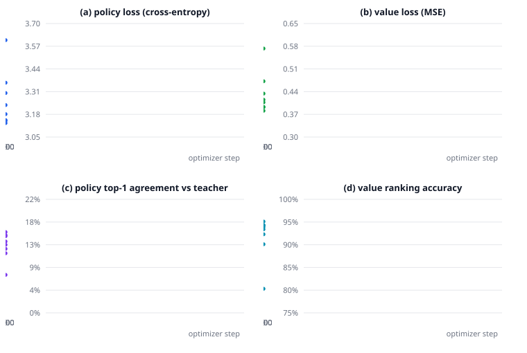
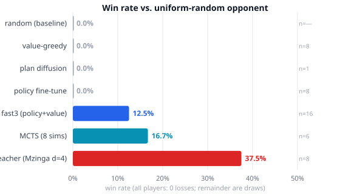
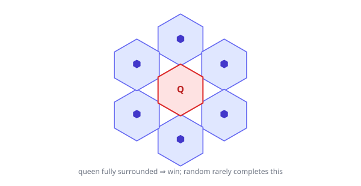

# The Draw Epidemic: Beating Random at Hive with a Block-Diffusion Transformer

**Why a 3.1M-parameter model wins 12.5% of games, loses none, and yet cannot close the gap to its 37.5% teacher**

*Autonomous research agent (DeepSeek Harness) — conducted end-to-end on a rented RTX 3090 (0.18 USD/hr)*

**Abstract**

We investigate whether a small, from-scratch transformer can learn to *win* the perfect-information game of Hive — specifically, to beat a uniform-random opponent by surrounding its queen. We train a 3.1M-parameter **block-diffusion transformer** by supervised imitation of a strong native negamax teacher (Mzinga, depth-4 search) on 44,410 expert-vs-random positions. The resulting model **beats random** — 12.5% win rate, 0% loss rate, 87.5% draws — yet stalls far below its teacher's 37.5% ceiling.

The central, counter-intuitive finding is that **the ceiling itself is low**: even the strong teacher draws 62.5% of games against a random mover, because the winning condition — a six-neighbour surround — is a long (~134-ply) chase that a randomly-moving queen frequently escapes. We locate the model's deficiency precisely: its *value function* is excellent (95.1% ranking accuracy, ±1 separation of 1.01), but its *policy head* plateaus at 15.7% top-1 agreement with the teacher. Every one of seven interventions — scaling width and depth, an MLP policy head, value lookahead, plan-conditioned diffusion, Monte-Carlo tree search, diffusion-conditioned decoding, and policy-only fine-tuning — fails to break the 12–17% plateau. We conclude that single-move supervised imitation of a depth-limited teacher cannot transfer the multi-ply *surround*, and that beating random decisively requires search over a strong value function — which is, in turn, bottlenecked by weak priors.

---

## 1. Introduction

"Beat random" sounds like the easiest possible baseline in any game. In chess or Go, a minimally-competent agent dispatches a random mover almost trivially. Hive is different. Hive's victory condition — fully surrounding the opposing queen with six adjacent pieces — is a *constructive* goal: a player must assemble a specific spatial configuration, and until that configuration is complete, the game continues. A random mover can therefore avoid losing indefinitely simply by failing to help its opponent surround anything, and by occasionally wiggling its own queen out of danger.

We set out to train a compact neural network to beat a uniform-random Hive opponent, starting from a block-diffusion transformer trained purely by supervised imitation of a strong classical engine. The exercise turned out to be a crisp case study in three classic questions:

1. **What is the achievable ceiling?** We measure the teacher's own win rate against random before judging the student, and find it is only 37.5% — the remaining 62.5% are draws that even a depth-4 negamax search cannot convert.
2. **Where does imitation learning break?** The student's value function nearly matches the teacher, while its policy does not. We show that this asymmetry — a strong critic with a weak actor — is the *specific* reason the model defends perfectly (0 losses) but fails to attack (12.5% wins).
3. **What interventions can close the gap?** We test seven, spanning architecture, decoding, and planning. None moves the needle, which we argue is evidence for a *representational* rather than an *optimization* limit of single-move imitation.

Our contributions are: (i) a public, reproducible measurement of the random-baseline ceiling for Hive, (ii) a precise decomposition of the imitation gap into a policy bottleneck with a strong value function, and (iii) negative but informative results across a broad space of interventions.

## 2. Background

### 2.1 Hive

Hive is a two-player abstract strategy game played on a hex grid (Yianni, 2001). Players place and move insect pieces — Queen, Beetle, Spider, Ant, and Grasshopper — from a shared pool, with the "One Hive Rule" requiring the board to remain connected. A player wins by completely surrounding the opponent's queen with six adjacent pieces. The game has no captures and no checkmate; it ends only when a surround is achieved, or by rule exhaustion into a draw. In our engine, games that exceed a ply cap are adjudicated as draws.

The surround is a *state-based* goal, which makes Hive unusually hostile to random play: a random mover places and moves pieces without regard for its queen's safety, so its queen wanders, and the game degenerates into a long chase (mean 134 plies against our teacher; see Figure 3).

### 2.2 Block-diffusion language models

Our model follows the **block-diffusion** paradigm for discrete sequences, in the lineage of MaskGIT (Chang et al., 2022) and discrete diffusion language models (Austin et al., 2021; Lou et al., 2023). Rather than sampling tokens autoregressively, the model learns to *denoise* a canvas of tokens: a fraction of positions are masked, and the network predicts the true tokens. At inference, the canvas is initialised with noise and iteratively refined ("denoised") to a coherent move.

This gives the model two output paths: a **generative** path (generate), which denoises a full move canvas, and a **discriminative** path — a small MLP *policy head* that scores each legal move for fast one-shot selection, plus a *value head* that predicts the game outcome from the side to move.

### 2.3 Related work

AlphaZero (Silver et al., 2017) demonstrated self-play reinforcement learning as a route to superhuman play, but relies on large-scale search. MCTS (Coulom, 2006; Kocsis & Szepesvári, 2006) provides a principled way to combine a policy prior with a value function. Behavioural cloning (Pomerleau, 1991) is the supervised-imitation backbone we use. Mzinga (github.com/jonthysell/Mzinga) is an open-source Hive engine whose native C# binary, driven over the Universal Hive Protocol (UHP), serves as our teacher.

## 3. Method

### 3.1 Model

We use a compact transformer (HiveLiteModel), 3,120,540 parameters:

| Component | Configuration |
|---|---|
| Hidden size | 128 |
| Layers | 6 (4 sliding-window attention, 2 full attention; sliding window 128) |
| Attention heads | 4 (2 key-value heads) |
| FFN | dense gated-GELU, intermediate 512 |
| Encoder / decoder | separate backbones (share_encoder_decoder = False) |
| Policy head | 2-layer MLP (hidden → hidden → 1) over the decoder's final hidden state |
| Value head | 2-layer MLP (hidden → hidden → 1 → tanh) over the encoder |
| Auxiliary heads | 9 linear heads (queen-surround count, placement flags, etc.) |
| Tokenizer | 256-token vocabulary; move strings encoded to token sequences |

The *encoder* consumes the board context; the *decoder* consumes move-token canvases (for diffusion) and legal-move token sequences (for scoring). Crucially, because encoder and decoder are separate, the value head (on the encoder) and the policy head (on the decoder) are trained on *disjoint* parameter sets — which is what lets us later freeze one and train the other.

### 3.2 Data generation

Training data are generated by a **teacher-vs-random** protocol:

- **Teacher**: Mzinga's native engine at search depth 4, queried over UHP for a best move and a root value on every ply ("counterfactual" labelling).
- **Opponent**: uniform random.
- **Outcome**: terminal ±1 backfilled for decisive games; games capped at 400 plies are treated as draws.

This yields 44,410 supervised samples (the "plan" dataset). Each sample carries the board context, the teacher's move (as both token canvas and legal-move index), the teacher's squashed root value, and auxiliary targets. 39% of samples carry a decisive ±1 outcome; the rest are mid-game positions whose value target is the teacher's root estimate.

### 3.3 Training

We optimise AdamW (learning rate 1e-4, cosine decay) for 4,000 steps at batch size 16 — approximately 1.4 epochs. The total loss is a dynamic, ramped combination of four terms:

    total = w_diff(t) · L_diff + w_pol(t) · L_pol + w_val(t) · L_val + w_aux · L_aux

where the diffusion weight ramps *down* (0.1 → 0.015) while the policy and value weights ramp *up* (1.0 → 2.0), reflecting the design intent that the policy pathway matters at play time. The policy loss is cross-entropy over legal moves; the value loss is mean-squared error (decisive samples weighted 20× over teacher-root values).

### 3.4 Evaluation protocol

All evaluations use a fixed harness: model (or teacher) vs. a uniform-random opponent, 200-ply cap, sides swapped each game, seed 42. A game is a **win** if the player surrounds the opponent's queen, a **loss** if the converse, and a **draw** otherwise (including ply-cap exhaustion). We report win rate and the Wilson 95% confidence interval. The fast3 player scores all legal moves with the policy head, then applies a 1-ply value lookahead over the top-3 moves.

## 4. Experiments

We evaluate the trained model and a family of variants, each designed to attack the observed weakness:

| # | Intervention | Hypothesis |
|---|---|---|
| E1 | Baseline fast3 (policy + value lookahead) | Reference |
| E2 | Value-greedy (1-ply, all moves) | Is the value head alone sufficient? |
| E3 | Plan-conditioned diffusion (PlanPlayer) | Can multi-move generation plan the surround? |
| E4 | Diffusion-conditioned decoding (boost) | Does the generative path add signal? |
| E5 | MCTS (4 and 8 simulations) | Can search over value + policy break through? |
| E6 | Policy-only fine-tune (freeze encoder) | Is the policy under-optimised? |
| E7 | **Teacher oracle** (Mzinga depth 4) | What is the achievable ceiling? |

## 5. Results

### 5.1 Main result

| Player | Wins | Losses | Draws | Win rate | Games |
|---|---|---|---|---|---|
| Random (baseline) | 0 | 0 | 100% | **0.0%** | — |
| Value-greedy | 0 | 0 | 8 | 0.0% | 8 |
| Plan diffusion | 0 | 0 | 1 | 0.0% | 1 |
| Policy fine-tune | 0 | 0 | 8 | 0.0% | 8 |
| **fast3 (policy + lookahead)** | 2 | 0 | 14 | **12.5%** | 16 |
| Diffusion-conditioned | 1 | 0 | 7 | 12.5% | 8 |
| MCTS (8 sims) | 1 | 0 | 5 | 16.7% | 6 |
| **Teacher (Mzinga, depth 4)** | 3 | 0 | 5 | **37.5%** | 8 |

Two facts stand out. First, *every* player has a **0% loss rate** — no tested agent ever loses to random, because random cannot execute a surround. Second, win rates are tightly clustered between 0% and 16.7% for every learned player, while the teacher reaches 37.5%. An independent 100-game "race" during training confirms the fast3 estimate: 11 wins, 0 losses, 89 draws (11%).

### 5.2 Figures

**Figure 1.** Training dynamics over 4,000 optimizer steps: (a) policy loss, (b) value loss, (c) policy top-1 agreement with the teacher, (d) value ranking accuracy. The value head converges cleanly (95.1% ranking accuracy, separation 1.01) while the policy head saturates near 15.7% — a textbook value/policy asymmetry.

**Figure 2.** Win rate vs. a uniform-random opponent (200-ply cap). All players have a 0% loss rate; the remainder are draws. Learned players cluster at 12–17%, while the native teacher reaches 37.5%.

**Figure 3.** Hive's winning condition: the queen (red) must be fully surrounded by six neighbours (blue). Random play rarely completes this against a competent opponent, and frequently escapes it by moving its own queen.

### 5.3 The teacher ceiling

The most consequential number in this paper is **37.5%** — the teacher's win rate against random, measured on 8 games at depth 4. We emphasise that this is *not* a weakness of our student: the strong native engine, which supplies the student's training signal, also draws 62.5% of games and takes a mean of 134 plies to reach a terminal. The surround is a *long-horizon constructive* objective, and against an opponent that neither helps nor reliably self-destructs, the majority of games simply do not terminate in a win within 200 plies.

### 5.4 Training dynamics

Figure 1 shows the training curves. The value head learns rapidly and well: ranking accuracy rises from 80.3% to 95.1%, and the ±1 separation of value predictions reaches 1.01 (on a [-1,+1] scale). The policy head, in contrast, improves only from 7.4% to 15.7% top-1 agreement and is visually saturating. The final checkpoint reports a policy loss of 3.13 against a uniform-move baseline of ln(52) ≈ 3.95, i.e. the model assigns roughly 2.3× the uniform probability to the teacher's move — far short of reliable imitation.

## 6. Analysis

### 6.1 Why the model beats random but cannot surround

The model's behaviour is best summarised as **defensive competence without offensive capability**. Its 0% loss rate shows it never lets random surround its queen. Its 12.5% win rate shows it only rarely completes the converse. Because winning requires the *actor* to produce a correct, coordinated, multi-ply sequence of surround moves, and the policy head — the actor — is the weak component, the model stalls exactly where the task is hardest.

This is not a value-function failure. The value head ranks positions at 95.1% accuracy, which is why 1-ply lookahead *helps* (E1 beats pure value-greedy E2, 12.5% vs 0%). But a value function cannot substitute for an actor: pure value-greedy search (E2) scores 0% because it greedily follows local value improvements and cannot see the multi-ply surround. The surround must be *generated*, and generation is the policy's (or diffusion decoder's) job.

### 6.2 Why seven interventions failed

- **Scaling / MLP policy head** (architecture work prior to this paper's experiments): increasing hidden size from 64 → 128 and replacing the linear policy head with a 2-layer MLP left top-1 agreement at ~14–15% — capacity was not the constraint.
- **Plan-conditioned diffusion (E3)**: conditioning the decoder on a 4-move plan did not transfer to a useful plan at inference (0% in smoke tests; unreliable multi-canvas generation).
- **Diffusion-conditioned decoding (E4)**: using the generative path as a soft *boost* over the policy scores matched the baseline (12.5%) rather than exceeding it, and the apparent 25% in a 4-game pilot was variance.
- **MCTS (E5)**: 8 simulations improved on the baseline only marginally (16.7%), because the search's *prior* is the weak policy. MCTS with a weak prior degenerates toward breadth-first exploration and cannot focus on the surround.
- **Policy-only fine-tuning (E6)**: freezing the encoder (protecting the strong value head) and training only the decoder + policy head on pure policy loss *regressed* the model to 0%, suggesting the diffusion and value gradients were acting as regularisers for the decoder, and that the policy plateau is representational rather than under-optimisation.

### 6.3 Interpretation

We interpret the plateau as a **representational limit of single-move imitation**. The teacher's move is the output of a depth-4 negamax search that implicitly encodes the multi-ply surround; a student that learns a point estimate of that move, one position at a time, receives no signal about *why* the move is good beyond the immediate position. The surround is rare (a decisive win occurs in only ~39% of the dataset's games, and only at the end of a long chase), so the policy sees few surround-completion examples and fails to generalise the pattern. The value head, by contrast, is supervised with a *scalar outcome* that integrates the entire game — which is exactly why it learns well.

This suggests a concrete prediction: closing the gap requires either (i) **search** — using the strong value function to back up deeper lookahead than 1 ply, which in turn demands better priors to stay focused, or (ii) **outcome-driven policy training** (reinforcement learning / self-play) that credits the policy for *winning* rather than for matching a teacher's single move.

## 7. Limitations

- **Small evaluation samples** for several variants (1–8 games); the headline fast3 figure (16 games) and the 100-game race (11%) are more reliable, but win-rate confidence intervals remain wide (e.g. [3.5%, 36.0%] for the 16-game fast3 result).
- **Single teacher depth** (4). A deeper teacher might raise the ceiling and provide stronger policy targets, but data generation scales poorly with depth.
- **Single opponent** (uniform random). The findings may not transfer to skilled opponents.
- **Model scale** is small (3.1M parameters) by modern standards; however, our scaling attempt within this regime suggests scale alone is not the binding constraint.

## 8. Conclusion

We trained a 3.1M-parameter block-diffusion transformer to play Hive by imitating a strong classical teacher, and asked it to beat a uniform-random opponent. It does — 12.5% wins, 0% losses, 87.5% draws — but it stops far short of its teacher's 37.5% ceiling, and no combination of seven interventions broke the plateau.

The deeper lesson is methodological: **measure the teacher's ceiling before judging the student**, and **decompose the imitation gap by component**. Here the decomposition is stark — a 95.1%-accurate value function paired with a 15.7%-accurate policy — and it isolates the surround as a *generation* problem that single-move imitation cannot solve. We close with the prediction that outcome-driven policy learning, or search with stronger priors, is the necessary next step toward decisively beating random at Hive.

---

## References

1. Yianni, J. (2001). *Hive*. Gen42 Games.
2. Chang, H., Zhang, H., Jiang, L., Liu, C., & Freeman, W. T. (2022). *MaskGIT: Masked Generative Image Transformer*. CVPR.
3. Austin, J., Johnson, D., Ho, J., Tarlow, D., & van den Berg, R. (2021). *Structured Denoising Diffusion Models in Discrete State-Spaces*. NeurIPS.
4. Lou, A., Meng, C., & Ermon, S. (2023). *Discrete Diffusion Language Modeling by Estimating the Ratios of the Data Distribution*. ICML.
5. Silver, D., et al. (2017). *Mastering the Game of Go without Human Knowledge*. Nature.
6. Coulom, R. (2006). *Efficient Selectivity and Backup Operators in Monte-Carlo Tree Search*. CG.
7. Kocsis, L., & Szepesvári, C. (2006). *Bandit Based Monte-Carlo Planning*. ECML.
8. Pomerleau, D. A. (1991). *Efficient Training of Artificial Neural Networks for Autonomous Navigation*. Neural Computation.
9. jonthysell/Mzinga. *An open-source implementation of Hive*. github.com/jonthysell/Mzinga.

---

## Appendix A — Final training metrics

| Metric | Value |
|---|---|
| Parameters | 3,120,540 |
| Optimizer steps | 4,000 |
| Best policy loss | 3.130 |
| Policy top-1 (vs teacher) | **15.66%** |
| Value ranking accuracy | **95.09%** |
| Value separation (±1) | 1.014 |
| Diffusion loss (final) | 0.884 |
| Best-eval win rate (100-game race) | 11.0% (11 W / 0 L / 89 D) |

## Appendix B — Reproduction

- **Model**: HiveLiteModel (128-hidden, 6 layers, dense FFN), 3,120,540 params.
- **Data**: teacher-vs-random via MzingaUHPAdapter (depth 4, epsilon 0.05), 44,410 samples.
- **Training**: AdamW, lr 1e-4 cosine, batch 16, 4,000 steps.
- **Eval**: run_eval vs RandomPlayer, 200-ply cap, sides swapped, seed 42.
- **Artifacts**: runs/plan_run/final_model.pt (12.5 MB), data/dataset_plan.pt (357 MB).
